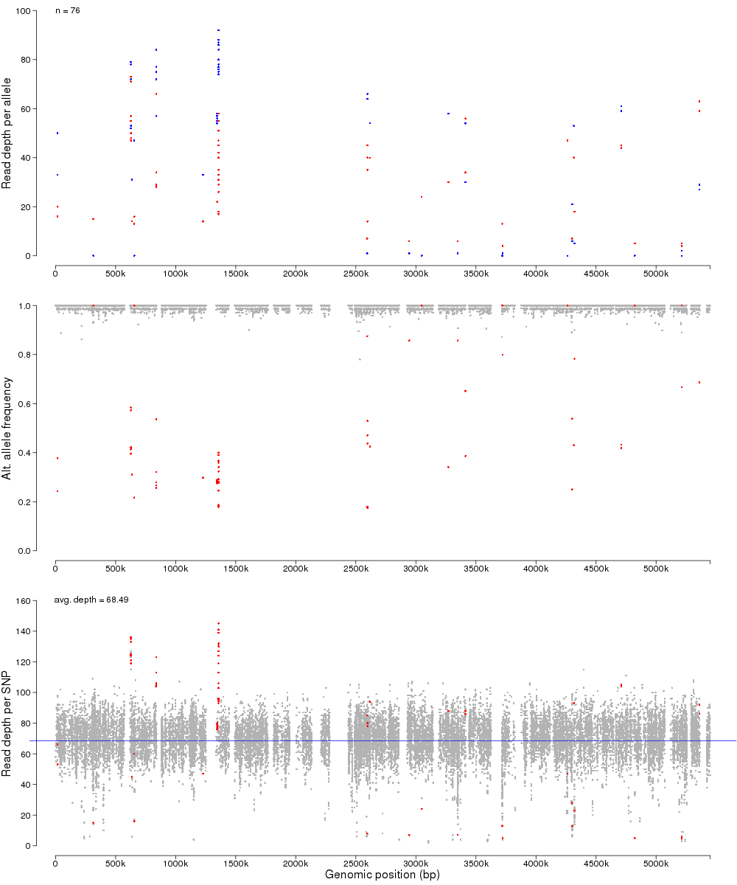
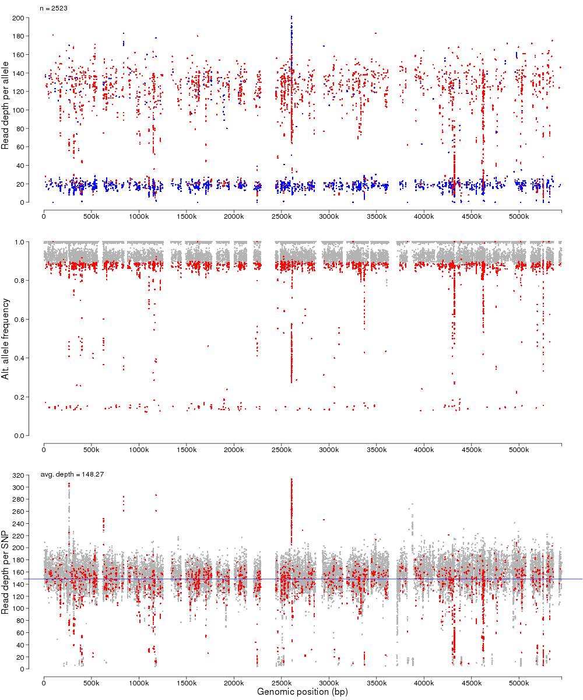

# Code for Detecting DNA Contamination in Sequence Reads

Yu Wan

First release: 13 Aug 2020; last modification: 14 Aug 2020


This repository offers code for visual evaluation of DNA contamination in sequence reads. Most code works on the variant call format (VCF). The latest specification is [VCF v4.3](https://samtools.github.io/hts-specs/VCFv4.3.pdf).


Dependencies:

- [VCFtools](https://vcftools.github.io/index.html)
- R, Rscript, and package optparse
- Linux bash


## 1. extractInfoFromVCF.sh

This bash script extracts values of sub-fields from field INFO using VCFtools and produces a tab-delimited file for each sample. Assuming every name of VCF files follows format `[sample name][shared root of filenames].vcf` (For example, `DT104x_hetSNPs.vcf`, where `DT104x` is the sample name and `_hetSNPs` is the filename root), this script can be run with the following parameters:

- `-i/--input`: A text file listing sample names for which VCF files will be accessed. One line per name.
- `-s/--source`: Directory where VCF files are stored.
- `-o/--output`: Output directory.
- `-r/--root`: Root shared by filenames of VCF files.
- `-f/--fields`: Names of sub-fields within field INFO for value extraction. Since field names POS, REF, ALT are not part of INFO and will always be extracted by VCFtools, they must not be placed in this parameter. DP4 is a mandatory field for `hetSNP_depthPlot.R`.
- `-d/--vcftoolsDir`: Installation directory of VCFtools. Default: current working directory.

Example command line:

`bash ~/cgSNPs/contamination/extractInfoFromVCF.sh -i sample_id.txt -s $PWD -o $PWD/het -r 'study1_sorted_qual_hetSNPs' -f 'DP,DP4' -d "${HOME}/anaconda3/envs/mapping/bin"`

Output filenames follow the format `[sample name]__info.tsv`. An example output (`DT104x__info.tsv`):

```text
CHROM	POS	REF	ALT	DP	DP4
DT104x_chr	62354	T	C	73	10,0,27,2
DT104x_chr	101232	C	G	45	15,2,3,2
DT104x_chr	103233	T	C	45	1,0,3,2
DT104x_chr	455942	G	T	47	2,2,22,2
```

Use command `which vcftools` to find out the installation directory of VCFtools.


## 2. hetSNP\_depthPlot.R

This R script draws read depths of heterozygous (het) and homozygous (hom) SNPs for a single sample. Specifically, read depths of heterozygous SNPs (hetSNPs) will be drawn as foreground points (blue and red), whereas those of homozygous SNPs (homSNPs) will be drawn as background points (light grey). The script has six parameters:

- `--hetSNP`: Path to a tab-delimited (TSV) file that contains the DP4 sub-field (within field INFO) of heterozygous SNPs extracted from a VCF file. Mandatory columns: CHROM, POS, DP4.
- `--homSNP`: Path to a tab-delimited (TSV) file that contains the DP4 sub-field (within field INFO) of homozygous SNPs extracted from a VCF file. Mandatory columns: CHROM, POS, DP4.
- `--sampleName`: A sample name that will be used as the filename prefix of outputs.
- `--genomeLen`: Length (in bp) of the reference genome to which reads are mapped.
- `--outdir`: Output directory.
- `--suffix`: A suffix added after the sample name in output filenames.

For each sample, the two input TSV files (hom and het) can be produced from one VCF file (generated with `bcftools mpileup` and so forth) using script `extractInfoFromVCF.sh`.

The script creates three output files:

- `[Number of hetSNPs]__[sample name]__[suffix].png`: The depth plot, which suggests purity of sequence library. The plot is comprised of three panels.
- `[sample name]__[suffix]__het.tsv`: A table summarising hetSNPs for the plot.
- `[sample name]__[suffix]__hom.tsv`: A table summarising homSNPs for the plot.

Examples from the development of [GeneMates](https://github.com/wanyuac/GeneMates).


<figure>
    
    <figcaption><b>Figure 1. Read depths from a putatively clean library of <i>E. coli</i> genome ERR178221.</b> Heterozygous SNPs are clustered within certain regions. Colours for the top panel: red, alternative alleles; blue, reference alleles.</figcaption>
</figure>

<figure>
    
    <figcaption><b>Figure 2. Read depths from a putatively contaminated library of <i>E. coli</i> genome ERR134517.</b> Heterozygous SNPs are spread across the whole length of genome and two bands of hetSNP read depths are shown in the bottom panel, which indicates the proportion of contaminated DNA in the library. Colours for the top panel: red, alternative alleles; blue, reference alleles.</figcaption>
</figure>


### hetSNP\_depthPlot\_slurm.sh

A bash script submitting SLURM jobs of `hetSNP_depthPlot.R` to a Linux computer cluster for a set of samples.
